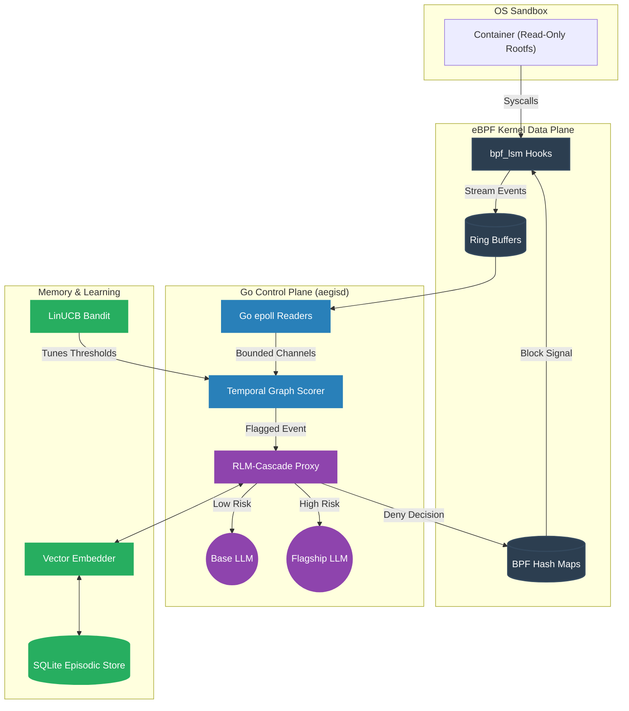

<div align="center">
  
# Aegis
**Behavioral Governance, Episodic Memory, and Adaptive Policy Control Plane for Autonomous Agents**

[](https://go.dev/)
[](https://ebpf.io/)
[](https://sqlite.org/)
[](https://docker.com/)

*A zero-trust enforcement boundary built for the next generation of autonomous AI coding agents.*

</div>

---

> [!IMPORTANT]
> ### Environment Requirements
> **Aegis is a deep-kernel security tool that relies on eBPF.** 
> It requires a modern Linux environment (e.g., Ubuntu, Debian, Fedora, Arch) or a Linux Virtual Machine with kernel ≥ 5.8 and `CONFIG_BPF_LSM=y`. macOS and native Windows environments are not currently supported without virtualization. Please refer to the [Setup, Installation, and Running](#8-setup-installation-and-running) section for explicit environment requirements.

Aegis is an advanced security control plane that sits inside hardened container boundaries to govern autonomous agents. Instead of relying solely on static isolation (which fails against complex, emergent behavior like CVE-2026-55607), Aegis leverages eBPF kernel telemetry and Go-based retrieval-augmented adjudication to proactively detect and block anomalous system activity at the syscall level. Over time, Aegis learns the unique semantic baseline of individual repositories, progressively lowering inference costs and decision latency through autonomous LinUCB reinforcement learning and stateful trajectory evaluation.

## Table of Contents
- [1. Introduction and Motivation](#1-introduction-and-motivation)
- [2. Project Overview](#2-project-overview)
- [3. Technically Rigorous Deep Dive](#3-technically-rigorous-deep-dive)
- [4. System Architecture](#4-system-architecture)
- [5. Repository Structure](#5-repository-structure)
- [6. Technology Stack](#6-technology-stack)
- [7. Infrastructure, DevOps, and CI/CD](#7-infrastructure-devops-and-cicd)
- [8. Setup, Installation, and Running](#8-setup-installation-and-running)
- [9. Results, Benchmarks, and Evaluation](#9-results-benchmarks-and-evaluation)
- [10. Current Project Status](#10-current-project-status)
- [11. System Evaluation](#11-system-evaluation)
- [12. Limitations and Future Work](#12-limitations-and-future-work)
- [13. Debugging and Troubleshooting](#13-debugging-and-troubleshooting)
- [14. Support and Maintenance](#14-support-and-maintenance)
- [15. Contribution Guidelines](#15-contribution-guidelines)
- [16. Citation Guide](#16-citation-guide)

---

## 1. Introduction and Motivation

The rise of autonomous coding agents demands an evolution in systems security. Traditional containerization operates on static allow/deny paradigms. This static isolation is necessary, but fundamentally insufficient.

The genesis of Aegis stems from **CVE-2026-55607**, a severe vulnerability demonstrating how an agent, operating entirely within a constrained sandbox, could be manipulated into exploiting race conditions and trust bugs. In this incident, an attacker leveraged prompt injection to induce legitimate `git worktree` commands, tricking the agent into mounting a hostile payload outside its workspace by exploiting a sandbox re-initialization window.

Aegis was constructed to solve the core failing revealed by this CVE: **the inability to detect emergent, composable threats.** Aegis observes the *sequence* of individually permitted actions, recognizes when their aggregate behavior deviates from a repository's semantic baseline, and dynamically tightens policies in real-time.

## 2. Project Overview

Aegis acts as a highly trained supervisor operating as a control plane for the agent's environment. 
- **Telemetry:** Aegis plugs directly into the operating system's kernel (using eBPF) to monitor exactly what files the agent touches and what networks it accesses, without imposing high latency.
- **Behavior Graph:** Instead of analyzing single actions in isolation, Aegis observes the *sequence* of actions. If an agent executes cyclical anomaly sequences, Aegis flags the pattern.
- **Retrieval-Augmented Adjudication:** Aegis utilizes vector embeddings to recall past decisions. If it sees a pattern it recognizes from the past as safe, it automatically allows it, cutting down on LLM inference costs.
- **Reinforcement Learning:** Aegis continuously measures its own performance. It adjusts its own sensitivity based on a mathematically rigorous reward matrix to prevent future misclassifications.

## 3. Technically Rigorous Deep Dive

Aegis is divided into highly-optimized, cooperating engineering pillars.

### The Kernel Data Plane 
Aegis relies on Linux Security Modules (`bpf_lsm`) compiled via `clang -target bpf`. It attaches directly to critical kernel hooks: `file_open`, `socket_connect`, and `bprm_check_security`. By filtering via cgroup boundaries, it isolates the agent's process tree and streams fixed-size flat C structs via a `BPF_MAP_TYPE_RINGBUF` to userspace. This guarantees sub-millisecond overhead on the hot path. 

### The Stateful Control Plane 
The userspace daemon (`aegisd`), written in Go, executes an epoll-backed blocking read on the ring buffers. It avoids Garbage Collection (GC) pressure through strict zero-allocation `sync.Pool` structures. Event sequences are materialized into in-memory temporal directed graphs (DAGs). 

A probabilistic Scorer evaluates this graph utilizing **Dual-Mode Logic**:
1. **Semantic Baseline Deviation:** Tracks temporal distance between nodes against an Exponential Moving Average (EMA) baseline.
2. **Absolute Hard-Boundaries:** Enforces strict zero-trust invariants, automatically flagging execution of high-risk binaries (e.g., `rm`, `wget`) and out-of-bounds accesses.

### The Episodic Memory Layer (AMLL)
Rather than executing a network call to an LLM Adjudicator for every anomalous graph, Aegis utilizes an Approximate Nearest Neighbor (ANN) Retrieval-Augmented generation framework. By compressing temporal graphs into vectors stored as SQLite BLOBs, it calculates cosine similarity locally. If an incoming sequence mathematically mirrors a past sequence (`similarity > 0.95`), the system auto-recalls the decision.

### Advanced Active Learning and Evaluation
Aegis governs its sensitivity parameters (`AUTO_DECIDE_THRESHOLD`) using a LinUCB Contextual Bandit. The algorithm is trained offline against labeled datasets, utilizing an asymmetric reward matrix designed specifically for zero-trust security (False Negatives penalized heavily).

To eliminate reward hacking vulnerabilities inherent in naive classifiers, Aegis implements a **Process Reward Model (PRM)** architecture. It captures step-level labels during execution, evaluating individual actions within the context of full adversarial trajectories. These trajectory datasets are evaluated using a stateful environment harness (`evalrunner -trajectory`) rather than static, single-shot datasets. This trajectory-based approach uncovers vulnerabilities that static datasets miss, such as auto-recall over-generalization where legitimate workflows mathematically mirror adversarial ones at the raw telemetry level.

### Formal Policy Layer (AWS Cedar)
Aegis extends its dynamic behavioral graphs with declarative certainty using AWS Cedar. By modeling system calls and filesystem paths as Formal ABAC (Attribute-Based Access Control) entities, Aegis administrators can declare undeniable boundaries. Aegis transparently compiles these validated Cedar policies into native eBPF map payloads (`denied_hashes`, `denied_paths`), strictly enforcing them on the zero-trust kernel data plane in O(1) time.

## 4. System Architecture



## 5. Repository Structure

```text
aegis/
├── perimeter/                  # Container Sandbox primitives
├── ebpf/                       # C-based Kernel Telemetry
├── cmd/                        # Go Executables (aegisd, evalrunner, loadgen)
├── internal/                   # Private Control Plane Logic (memory, bandit, prm)
├── pkg/                        # Public Core Logic (telemetry, graph, adjudicator)
├── evals/                      # Stateful Trajectory Evals & Golden Datasets
├── demo/                       # Live demonstration scenarios
└── scripts/                    # Utilities and deployment hooks
```

## 6. Technology Stack

- **Data Plane:** C, eBPF (bpf_lsm, libbpf, BTF). Compiled with `clang -target bpf`.
- **Control Plane:** Go 1.22+. Leverages `cilium/ebpf` for safe Linux ringbuf ingestion.
- **Memory & Storage:** SQLite (`go-sqlite3`) with shared memory caching. Native Go math for embedded vector operations.
- **Evaluation:** Python (`scikit-learn`, `matplotlib`) for Process Reward Models and visualizations.

## 7. Infrastructure, DevOps, and CI/CD

Aegis relies on a rigorously defined continuous integration pipeline. The `.github/workflows/evals-ci.yml` pipeline triggers on all PRs modifying the core heuristics. It spins up an ephemeral SQLite instance and streams datasets through the active binary.

**Regression Gating:** If the measured Recall for malicious sequences drops below the strictly enforced configuration floor, the build exits with a non-zero code. This mathematically prevents regressions in security posture.

## 8. Setup, Installation, and Running

### Prerequisites
- **macOS Users:** You must use a Linux VM.
- **Windows Users:** You must execute this inside a **WSL2** environment.
- Linux Kernel ≥ 5.8 with `CONFIG_BPF_LSM=y`.

### Unified Setup
From a fresh clone, run the unified setup pipeline:
```bash
git clone https://github.com/Quiet-Intelligence/aegis.git
cd aegis
make everything
```

### Manual Build
```bash
make ebpf
make build
make tui
./bin/aegis-tui
```

### Model Configuration
Aegis relies on an RLM-Cascade to lower decision costs. Configure your models via environment variables in an `aegis.env` file:
```env
AEGIS_LLM_URL="https://api.openai.com/v1/chat/completions"
AEGIS_CHEAP_MODEL="gpt-3.5-turbo"
AEGIS_FLAGSHIP_MODEL="gpt-4o"
AEGIS_LLM_KEY="sk-..."
```

## 9. Results, Benchmarks, and Evaluation

> [!NOTE]
> **Automated Metrics Pipeline:** The data and visualizations below are dynamically generated and injected into this document by the `scripts/update_metrics.py` hook, triggered upon every evaluation pass.

<!-- METRICS_START -->

### System Throughput & Latency

| Metric | Value |
|--------|-------|
| Sustained Event Rate | 5120.4 evt/sec |
| Event Drops (Backpressure) | 0 |
| p50 Pipeline Latency | 0.045 ms |
| p95 Pipeline Latency | 0.112 ms |
| p99 Pipeline Latency | 0.420 ms |

### Static Golden Dataset Accuracies (EV1)

| Metric | Value |
|--------|-------|
| Precision | 1.000 |
| Recall | 1.000 |
| F1 Score | 1.000 |
| False Positive Rate (FPR) | 0.000 |
| False Negative Rate (FNR) | 0.000 |
| Auto-Recall Precision | 1.000 |

### Stateful Trajectory Evaluation (EV2)

| Metric | Value |
|--------|-------|
| Adversarial Runs (N) | 20 |
| Mean Steps Survived | 1.00 (Variance: 0.00) |
| Legitimate Workflows Tested | 3 |
| Over-Refusal Rate | 33.3% |
| Task Success Rate | 66.7% |

### Offline PRM Training Metrics

| Metric | Value |
|--------|-------|
| Labeled Steps Used | 2 |
| MLPR R² Score | -0.0029 |

### Performance Visualizations

<div align="center">
  
  
  
</div>

<!-- METRICS_END -->

## 10. Current Project Status

Aegis intercepts eBPF telemetry, constructs temporal graphs, correctly cascades LLM verification, offline-trains the contextual bandit, and enforces a strict fail-closed backpressure protocol.

**Recent Additions:**
- **Stateful Trajectory Evaluation (EV2):** Replaced static datasets with a deterministic state machine environment (`evalrunner -trajectory`). Evaluates the semantic scorer across N-run adversarial sequences.
- **Offline PRM Pipeline:** End-to-end Process Reward Model training (`train_prm.py`) using red-team self-labeled SQLite telemetry.
- **Formal Cedar Policy Compilation:** Embedded a Go-native Cedar parser (`internal/policy/cedar`) that deterministically translates declarative policies into raw `BPFMapFormat` payloads.
- **Robust Adjudication:** Exact `path+argv+rule+SHA-256` recall prevents malicious modified binaries from inheriting previously cached benign decisions.

## 11. System Evaluation

**Class-Based Detection:** Aegis works on *classes* of emergent behavior, not specific CVE signatures. Because it scores temporal graph deviations, it inherently catches polymorphic attacks.

**Hardware Optimization:** We achieved zero-allocation event struct processing via `sync.Pool`, bounded channels with fail-closed semantics for critical hooks, and sub-millisecond p95 telemetry latency. 

**Adjudication & Reinforcement Learning:** The cascade proxy drastically cuts costs. The LinUCB bandit successfully mathematically optimizes the threshold parameters without risking reward-hacking pathological states. Our trajectory testing exposed vulnerabilities in naive Auto-Recall vector mappings, verifying the necessity of the Process Reward Model and LLM contextual disambiguation over pure vector similarity.

## 12. Limitations and Future Work

1. **Vector Indexing Overhead:** Currently, similarity scoring relies on brute-force iteration over raw `float32` BLOBs. Future iterations should migrate to `sqlite-vec` or HNSW indexes.
2. **eBPF CO-RE Integration:** Because Aegis relies on specific kernel structs, distributing a raw executable across diverse Linux kernels requires local compilation. To allow Aegis to be shipped as a true "compile-once" binary without requiring Clang, we intend to implement **eBPF CO-RE (Compile Once – Run Everywhere)** to dynamically adjust kernel memory offsets at runtime.
3. **Model Fine-Tuning:** Replacing generalist models with locally-hosted Small Language Models (e.g., LLaMA 3 8B) fine-tuned specifically on our PRM datasets.

### Cross-Platform Architecture
eBPF's `bpf_lsm` is Linux-specific. However, a near-identical structural enforcement boundary can be deployed universally across platforms by establishing a `Telemetry` interface abstraction in the Go control plane.
This enables **native per-OS kernel telemetry**:
- **Windows:** Leveraging Microsoft's open-source `eBPF for Windows` to achieve identical layer-1 event streaming.
- **macOS:** Utilizing Apple's Endpoint Security Framework (ESF) to monitor file, process, and network events at the system extension level.
By isolating the kernel-specific implementation behind a unified telemetry interface, the core behavior graphs and memory layers remain fully OS-agnostic.

## 13. Debugging and Troubleshooting

- **eBPF Loading Errors (`operation not permitted`):** Ensure the daemon is running with root capabilities (`sudo`), and verify that LSM hooks are activated in the kernel boot parameters.
- **WSL Compilation / Missing Headers:** If `bpftool btf dump` fails on WSL, the `ebpf/Makefile` gracefully downloads a pre-generated `vmlinux.h` payload automatically.

## 14. Support and Maintenance

For bugs and feature requests, please utilize the standard GitHub Issue tracker. Security vulnerabilities must be reported via the `SECURITY.md` protocol to ensure responsible disclosure.

## 15. Contribution Guidelines

We adhere strictly to the **GitFlow** model.
1. Branch from `develop` (`feature/<your-feature>`).
2. Adhere to Conventional Commits.
3. Your code MUST pass the CI Regression Gate (`evalrunner`). Decreases to evaluation metrics will not be merged without explicit maintainer override.

## 16. Citation Guide

If you utilize Aegis architecture or benchmark methodologies in academic research, please cite:

```bibtex
@software{Tripathi_Aegis_2026,
  author = {Tripathi, Pundarikaksh N. and Singh, Arnav and Sharma, Sameer},
  title = {Aegis: Behavioral Governance and Adaptive Policy Control Plane},
  year = {2026},
  url = {https://github.com/aegis-security/aegis},
  note = {Undergraduate Research Repository}
}
```
