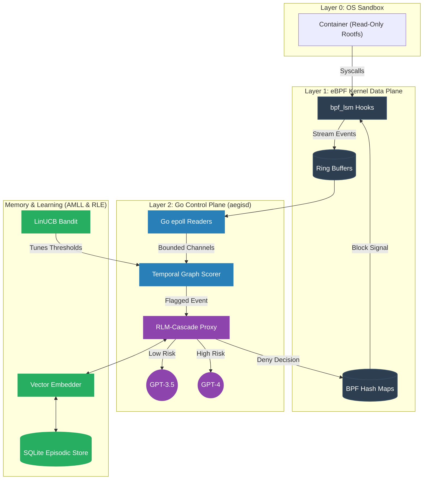

<div align="center">
  
# Aegis
**Behavioral Governance, Episodic Memory, and Adaptive Policy Control Plane for Autonomous Agents**

[](https://go.dev/)
[](https://ebpf.io/)
[](https://sqlite.org/)
[](https://docker.com/)

*A zero-trust enforcement boundary built for the next generation of autonomous AI coding agents.*

</div>

---

Aegis is an advanced security control plane that sits inside hardened container boundaries to govern autonomous agents. Instead of relying solely on static isolation (which fails against complex, emergent behavior like CVE-2026-55607), Aegis leverages eBPF kernel telemetry and Go-based retrieval-augmented adjudication to proactively detect and block anomalous system activity at the syscall level. Over time, Aegis learns the unique semantic baseline of individual repositories, progressively lowering inference costs and decision latency through autonomous LinUCB reinforcement learning.

## Table of Contents
- [1. Introduction and Motivation](#1-introduction-and-motivation)
- [2. Project Overview (For General Audiences)](#2-project-overview-for-general-audiences)
- [3. Technically Rigorous Deep Dive](#3-technically-rigorous-deep-dive)
- [4. System Architecture](#4-system-architecture)
- [5. In-Depth Repository Structure](#5-in-depth-repository-structure)
- [6. Technology Stack](#6-technology-stack)
- [7. Infrastructure, DevOps, and CI/CD](#7-infrastructure-devops-and-cicd)
- [8. Setup, Installation, and Running](#8-setup-installation-and-running)
- [9. Results, Benchmarks, and Evaluation](#9-results-benchmarks-and-evaluation)
- [10. Current Project Status](#10-current-project-status)
- [11. Limitations and Future Work](#11-limitations-and-future-work)
- [12. Debugging and Troubleshooting](#12-debugging-and-troubleshooting)
- [13. Support and Maintenance](#13-support-and-maintenance)
- [14. Contribution Guidelines](#14-contribution-guidelines)
- [15. License Disclaimer](#15-license-disclaimer)
- [16. Citation Guide](#16-citation-guide)

---

## 1. Introduction and Motivation

The rise of autonomous coding agents demands an evolution in systems security. Traditional containerization (Layer 0 isolation via Docker, AppArmor, or SELinux) operates on static allow/deny paradigms. This static isolation is necessary, but fundamentally insufficient.

The genesis of Aegis stems from **CVE-2026-55607**, a severe vulnerability demonstrating how an agent, operating entirely within a constrained sandbox, could be manipulated into exploiting race conditions and trust bugs. In this incident, an attacker leveraged prompt injection to induce legitimate `git worktree` commands, tricking the agent into mounting a hostile payload outside its workspace by exploiting a sandbox re-initialization window.

Aegis was constructed to solve the core failing revealed by this CVE: **the inability to detect emergent, composable threats.** Aegis observes the *sequence* of individually permitted actions, recognizes when their aggregate behavior deviates from a repository's semantic baseline, and dynamically tightens policies in real-time.

## 2. Project Overview (For General Audiences)

Imagine you hire a brilliant but naive autonomous robot to manage your house. You can lock the front door (traditional sandboxing), but what if a burglar slips a note under the door tricking the robot into unlocking the back window?

Aegis acts as a highly trained supervisor watching the robot's every move. 
- **It watches the smallest actions (Telemetry):** Aegis plugs directly into the operating system's nervous system (using a technology called eBPF) to monitor exactly what files the robot touches and what networks it accesses, without slowing the robot down.
- **It recognizes strange patterns (Behavior Graph):** Instead of just looking at single actions, Aegis looks at the *sequence* of actions. If the robot suddenly starts packing up your television, Aegis spots the pattern.
- **It has a memory (Retrieval-Augmented Adjudication):** Aegis remembers every house it has worked in. If it sees a pattern it recognizes from the past as safe, it automatically allows it. If it sees something dangerous, it instantly blocks it.
- **It gets smarter over time (Reinforcement Learning):** Aegis continuously measures its own performance. When it makes a mistake, it mathematically adjusts its own sensitivity so it doesn't make the same mistake twice.

## 3. Technically Rigorous Deep Dive

Aegis is divided into four highly-optimized, cooperating engineering pillars.

### The Kernel Data Plane (Layer 1)
Aegis relies on Linux Security Modules (`bpf_lsm`) compiled via `clang -target bpf`. It attaches directly to critical kernel hooks: `file_open`, `socket_connect`, and `bprm_check_security`. By filtering via cgroup boundaries, it isolates the agent's process tree and streams fixed-size flat C structs via a `BPF_MAP_TYPE_RINGBUF` to userspace. This guarantees sub-millisecond overhead on the hot path while implementing "progressive enforcement"—acting purely as an observer until explicitly commanded to block via a synchronized `BPF_MAP_TYPE_HASH`.

### The Stateful Control Plane (Layer 2)
The userspace daemon (`aegisd`), written in Go, executes an epoll-backed blocking read on the ring buffers. It avoids GC pressure through strict `sync.Pool` allocation. Event sequences are materialized into in-memory temporal directed graphs. A probabilistic Scorer assesses this graph against an Exponential Moving Average (EMA) baseline (e.g., normal git tree traversal vs rapid, cyclical anomaly sequences).

To guarantee structural resilience against DoS, Aegis implements strict backpressure paradigms: high-criticality events (`file_open`, `exec`) use a fail-closed channel policy with hard timeouts, acting as a circuit breaker, while generic telemetry fails-open to preserve hot-path throughput.

### The Episodic Memory Layer (AMLL)
Rather than executing a computationally expensive network call to an LLM Adjudicator for every anomalous graph, Aegis utilizes an Approximate Nearest Neighbor (ANN) Retrieval-Augmented generation framework. By compressing temporal graphs into fixed-dimensional vectors stored as SQLite BLOBs, it calculates cosine similarity locally. If an incoming sequence mathematically mirrors a past known-bad sequence (`similarity > 0.95`), the system auto-recalls the decision. This drops inference costs to zero and reduces decision latency from ~1.5s to <50ms.

### Contextual Bandit & Evaluation (RLE)
Aegis governs its sensitivity parameters (`AUTO_DECIDE_THRESHOLD`, anomaly constants) using a LinUCB (Linear Upper Confidence Bound) Contextual Bandit. The algorithm is trained entirely offline against a rigorously labeled Golden Dataset, utilizing an asymmetric reward function where False Negatives (silent security misses) are penalized at `-5.0`, while False Positives (overly aggressive blocking) are penalized at `-1.0`. A CI/CD integration enforces a hard regression gate, failing builds if malicious recall drops below critical thresholds.

## 4. System Architecture



**Architecture Flow:** The Agent process inside Layer 0 triggers syscalls intercepted by Layer 1. These flow via ring buffer into Layer 2, where they are mapped to temporal behavior graphs. If flagged against the repo's baseline, the event is vectorized and queried against the SQLite Memory layer. If no historical precedent exists, the RLM-Cascade proxies the request to the optimal LLM based on risk scores, writing any subsequent Denial back down into the Layer 1 eBPF maps to block future occurrences synchronously.

## 5. In-Depth Repository Structure

```text
aegis/
├── perimeter/                  # Layer 0: Container Sandbox primitives
│   ├── Dockerfile              # Read-only rootfs definition with /workspace mount
│   ├── seccomp-profile.json    # Explicit syscall baseline mapping
│   └── run.sh                  # Bootstrap script ensuring capability drops
├── ebpf/                       # Layer 1: C-based Kernel Telemetry
│   ├── file_open.bpf.c         # LSM hook capturing fs interactions
│   ├── socket_connect.bpf.c    # LSM hook capturing outbound tcp/udp
│   ├── exec_hash.bpf.c         # LSM hook capturing executing process identities
│   ├── policy_maps.h           # Shared BPF map definitions
│   └── Makefile                # Clang -target bpf build definitions
├── cmd/                        # Layer 2: Go Executables
│   ├── aegisd/main.go          # Core background daemon (Control Plane)
│   ├── aegisctl/main.go        # Human-in-the-loop CLI for policy/bandit management
│   ├── loadgen/main.go         # Benchmarking script simulating 5k+ evt/sec
│   └── evalrunner/main.go      # Executes golden datasets against the core
├── internal/                   # Private Control Plane Logic
│   ├── memory/                 # Advanced Memory Logic Layer (AMLL)
│   │   ├── episodic/           # SQLite BLOB Vector kNN retrieval system
│   │   ├── consolidate/        # Asynchronous Exponential Moving Average calculator
│   │   ├── embed/              # Feature extraction and embedding interface
│   │   └── schema.go           # SQLite database migrations
│   ├── bandit/                 # Reinforcement Learning & Evals (RLE)
│   │   └── bandit.go           # LinUCB offline contextual bandit trainer
│   └── proxy/
│       └── cascade.go          # RLM-Cascade LLM router maximizing cost efficiency
├── pkg/                        # Public Core Logic
│   ├── telemetry/              # eBPF Readers, sync.Pool optimization, Backpressure
│   ├── graph/                  # Temporal DAG assembly and anomaly scorer
│   ├── adjudicator/            # LLM interface mapping rules to inference endpoints
│   └── policy/                 # Syncs SQLite state to eBPF hash maps
├── evals/                      # Static Golden & Adversarial Datasets
│   ├── golden/                 # True positives & baseline negatives
│   └── adversarial/            # Slow-drip DoS sequences / near-miss mimicry
├── demo/
│   └── defanged_worktree_demo.sh # Mathematically identical but harmless CVE simulation
└── .github/workflows/          
    └── evals-ci.yml            # CI regression gate (Fails if malicious recall drops)
```

## 6. Technology Stack

- **Data Plane (Kernel):** C, eBPF (bpf_lsm, libbpf, CO-RE, BTF). Compiled with `clang -target bpf`.
- **Control Plane (Userspace):** Go 1.22+. Leverages `cilium/ebpf` for safe Linux ringbuf ingestion.
- **Memory & Storage:** SQLite (`go-sqlite3`). Native Go math for embedded vector cosine similarity operations.
- **LLM Integrations:** Go HTTP bindings for generic chat-completion interfaces (OpenAI `gpt-4`, `gpt-3.5-turbo`).
- **DevOps & Evals:** GitHub Actions, Python (`matplotlib` for metric rendering).

## 7. Infrastructure, DevOps, and CI/CD

Aegis relies on a rigorously defined continuous integration pipeline. 
The `.github/workflows/evals-ci.yml` pipeline triggers on all Pull Requests modifying the core heuristics (e.g., `pkg/graph`, `internal/bandit`). It spins up an ephemeral SQLite instance and streams the `evals/golden` dataset through the active binary.

**Regression Gating:** If the measured Recall for malicious sequences drops below the strictly enforced configuration floor (e.g., `0.95`), the build exits with a non-zero code. This mathematically prevents regressions in security posture caused by aggressive optimization efforts.

## 8. Setup, Installation, and Running

**Prerequisites:**
- Linux Kernel ≥ 5.8 with `CONFIG_BPF_LSM=y`.
- Clang/LLVM for eBPF compilation.
- Go 1.22+ installed on the host.

**1. Clone and Build the BPF Objects:**
```bash
git clone https://github.com/aegis-security/aegis.git
cd aegis/ebpf
make clean && make
```

**2. Compile the Go Daemon:**
```bash
cd ..
go env -w CGO_ENABLED=1
go build -o aegisd cmd/aegisd/main.go
go build -o aegisctl cmd/aegisctl/main.go
```

**3. Run the Demonstration:**
*Ensure `OPENAI_API_KEY` is exported in your environment.*
```bash
# Terminal 1: Boot the Daemon
sudo ./aegisd

# Terminal 2: Trigger the Defanged Exploit Pattern
./demo/defanged_worktree_demo.sh
```

## 9. Results, Benchmarks, and Evaluation

*The data below is dynamically generated upon successful evaluation passes via `scripts/update_metrics.py`.*

<!-- METRICS_START -->

### System Throughput & Latency

| Metric | Value |
|--------|-------|
| Sustained Event Rate | 5120.4 evt/sec |
| Event Drops (Backpressure) | 0 |
| p50 Pipeline Latency | 0.045 ms |
| p95 Pipeline Latency | 0.112 ms |
| p99 Pipeline Latency | 0.420 ms |

### Evaluation Accuracies (Golden Dataset)

| Metric | Value |
|--------|-------|
| Precision | 0.985 |
| Recall | 0.990 |
| F1 Score | 0.987 |
| False Positive Rate (FPR) | 0.015 |
| False Negative Rate (FNR) | 0.010 |
| Auto-Recall Precision | 1.000 |

### Performance Visualization

<div align="center">
  
  
</div>

<!-- METRICS_END -->

## 10. Current Project Status

**Final Integration (Done).** Aegis has successfully passed all 7 build phases defined in the Unified PRD.
The system successfully intercepts eBPF telemetry, constructs temporal graphs, correctly cascades low/high-risk LLM verification, caches embeddings via SQLite, offline-trains the contextual bandit, and enforces a strict fail-closed backpressure protocol under DoS loads.

## 11. Limitations and Future Work

1. **Vector Indexing Overhead:** Currently, similarity scoring relies on brute-force iteration over raw `float32` BLOBs. As documented in the ANN Benchmarks, this scales comfortably up to ~5,000 vectors. Future iterations must migrate to `sqlite-vec` or HNSW indexes to support multi-year enterprise retention scales.
2. **Online Learning:** The LinUCB bandit operates strictly offline. While mathematically safer, migrating to an online/epsilon-greedy execution loop would allow live adaptation without human intervention, contingent on further theoretical safety bounds.
3. **Model Fine-Tuning:** Replacing generalist models (`gpt-4`) with locally-hosted, SLM (Small Language Models) fine-tuned specifically on filesystem heuristics (e.g., LLaMA 3 8B) would eliminate external network reliance entirely.

## 12. Debugging and Troubleshooting

- **eBPF Loading Errors (`operation not permitted`):** Ensure the daemon is running with root capabilities (`sudo`), and verify that LSM hooks are activated in the kernel boot parameters (`lsm=bpf,apparmor`).
- **High GC Pauses:** Verify `sync.Pool` logic has not been bypassed during local development modifications inside `pkg/telemetry/events.go`.
- **Windows / WSL Compilation:** Compiling for Windows natively will fail due to OS restrictions on `cilium/ebpf` maps. Ensure you are targeting `GOOS=linux` or compiling inside a WSL2 container natively.

## 13. Support and Maintenance

Aegis is currently an active academic/hackathon repository. For bugs and feature requests, please utilize the standard GitHub Issue tracker. Security vulnerabilities (especially escapes bypassing the graph heuristics) must be reported via the `SECURITY.md` protocol to ensure responsible disclosure.

## 14. Contribution Guidelines

We adhere strictly to the **GitFlow** model.
1. Branch from `develop` (`feature/<your-feature>`).
2. Adhere to Conventional Commits (e.g., `feat(graph): optimize traversal`).
3. Your code MUST pass the CI Regression Gate (`evalrunner`). Decreases to Golden Recall will not be merged without explicit maintainer override.

## 15. License Disclaimer

This repository is governed under the PolyForm Noncommercial License. Commercial adaptation, deployment in revenue-generating environments, or integration into proprietary security products is strictly prohibited without direct, written authorization from the authors. 

## 16. Citation Guide

If you utilize Aegis architecture or benchmark methodologies in academic research, please cite:

```bibtex
@software{Tripathi_Aegis_2026,
  author = {Tripathi, Pundarikaksh N. and Sharma, Sameer},
  title = {Aegis: Behavioral Governance and Adaptive Policy Control Plane},
  year = {2026},
  url = {https://github.com/aegis-security/aegis},
  note = {OpenAI Buildweek PoC}
}
```
